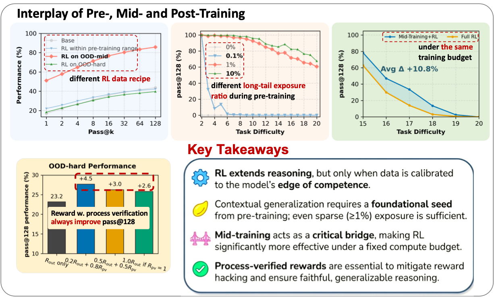

<h1 align="center">
On the Interplay of Pre-Training, Mid-Training, and RL on Reasoning Language Models
</h1>

<div align="center">

<a href="https://chenlong-clock.github.io">Charlie Zhang</a>, <a href="https://www.phontron.com">Graham Neubig</a>, 
<a href="https://xiangyue9607.github.io">Xiang Yue</a>

Carnegie Mellon University, Language Technologies Institute

</div>

<div align="center">

[](https://arxiv.org/abs/2512.07783)
[](LICENSE)


</div>

## Does Reinforcement Learning Truly Extend Reasoning?
- **The "Capability Refiner" View**: Some work characterizes RL as a refiner of existing skills, amplifying abilities already learned during pre-training. RL shows limited ability to improve pass@k compared with base model.

- **The "New Competency" View**: Some studies present evidence of substantial reasoning gains beyond pre-training, suggesting RL can induce genuinely new compositional skills.


This discrepancy arises from **a lack of control**. With models trained on **opaque internet corpora**, we cannot know what reasoning primitives the base model has already internalized. **Our work's goal is to resolve this conflict through controlled analysis.**


## 🔍 Overview

Our paper builds a **fully controlled experimental framework** to analyze how **pre-training**, **mid-training**, and **RL-based post-training** jointly shape the reasoning abilities of language models. Using synthetic math-style reasoning tasks with **explicit atomic operations** and **process-verifiable reasoning traces**, we study:

- **Extrapolative generalization** to more complex compositions (deeper dependency graphs).
- **Contextual generalization** across diverse surface forms and linguistic contexts.
- How **RL interacts** with prior knowledge, and when it yields **genuine capability gains** beyond pre-training.

## 🧠 Key findings
<div align="center">
  <h1 align="center">
    
    </h1>
</div>


## Code and Data
Code and data will be released very soon.

## 📚 Citation

If you find this work or code useful, please consider citing:

```bibtex
@misc{zhang2025interplaypretrainingmidtrainingrl,
      title={On the Interplay of Pre-Training, Mid-Training, and RL on Reasoning Language Models}, 
      author={Charlie Zhang and Graham Neubig and Xiang Yue},
      year={2025},
      eprint={2512.07783},
      archivePrefix={arXiv},
      primaryClass={cs.CL},
      url={https://arxiv.org/abs/2512.07783}, 
}
```


## 📝 License

This project is released under the MIT License.
See [LICENSE](LICENSE) for details.