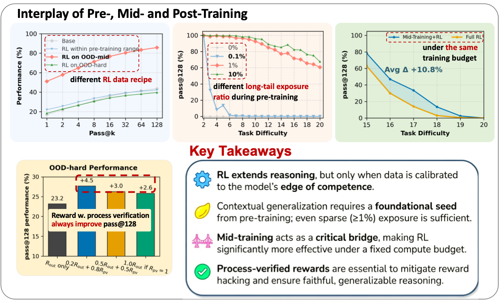

<h1 align="center">
On the Interplay of Pre-Training, Mid-Training, and RL on Reasoning Language Models
</h1>

<div align="center">

<a href="https://chenlong-clock.github.io">Charlie Zhang</a>, <a href="https://www.phontron.com">Graham Neubig</a>, 
<a href="https://xiangyue9607.github.io">Xiang Yue</a>

Carnegie Mellon University, Language Technologies Institute

</div>

<div align="center">

[](https://arxiv.org/abs/2512.07783)
[](LICENSE)


</div>

## Does Reinforcement Learning Truly Extend Reasoning?
- **The "Capability Refiner" View**: Some work characterizes RL as a refiner of existing skills, amplifying abilities already learned during pre-training. RL shows limited ability to improve pass@k compared with base model.

- **The "New Competency" View**: Some studies present evidence of substantial reasoning gains beyond pre-training, suggesting RL can induce genuinely new compositional skills.


This discrepancy arises from **a lack of control**. With models trained on **opaque internet corpora**, we cannot know what reasoning primitives the base model has already internalized. **Our work's goal is to resolve this conflict through controlled analysis.**


## 🔍 Overview

Our paper builds a **fully controlled experimental framework** to analyze how **pre-training**, **mid-training**, and **RL-based post-training** jointly shape the reasoning abilities of language models. Using synthetic math-style reasoning tasks with **explicit atomic operations** and **process-verifiable reasoning traces**, we study:

- **Extrapolative generalization** to more complex compositions (deeper dependency graphs).
- **Contextual generalization** across diverse surface forms and linguistic contexts.
- How **RL interacts** with prior knowledge, and when it yields **genuine capability gains** beyond pre-training.

## 🧠 Key findings
<div align="center">
  <h1 align="center">
    
    </h1>
</div>

You may also find the comic generated by Notebook LLM [here](assets/Interplay-LM-Reasoning.pdf).

## Installation

We recommend installing the code from the repository root in a fresh Python environment. The experiments were run with Python 3.12 and PyTorch 2.7.1+cu128 in a `physics_rl` environment. Other Python 3.9+ environments may work, but make sure your PyTorch build matches the CUDA version available on your machine or cluster.

```bash
git clone https://github.com/Interplay-LM-Reasoning/Interplay-LM-Reasoning.git
cd Interplay-LM-Reasoning

conda create -n physics_rl python=3.12 -y
conda activate physics_rl
python -m pip install --upgrade pip
```

Install the LLaMA-Factory pre-training stack and the local verl RL stack:

```bash
pip install -e ./LLaMA-Factory
pip install -e ./verl[vllm]
```

Recommended core versions:

- Python: `3.12`
- PyTorch: `2.7.1+cu128`
- vLLM: `0.10.1.1`

Finally, run commands from the repository root so local modules such as `utils` and `verl` resolve correctly:

```bash
export PYTHONPATH="$PWD:${PYTHONPATH:-}"
```

## Code

The training scripts are organized around the three stages studied in the paper:

- **Pre-training / mid-training** uses the LLaMA-Factory pipeline with configs under `scripts/composition`, `scripts/context`, and `scripts/mixed`.
- **RL post-training** uses verl / GRPO configs under the corresponding `rl-200steps` directories.
- **Evaluation** is launched through the shared runner in `scripts/meta_run.sh`, with checkpoint roots and evaluation data controlled by environment variables.

Set `CUDA_VISIBLE_DEVICES` before running the scripts. Most entry scripts call `scripts/meta_run.sh`, which accepts `LLAMA_CONFIG`, `VERL_CONFIG`, `EVAL_DATA_ROOT`, `EVAL_CHECKPOINTS_ROOT`, and `EVAL_EXTRA_ARGS` as environment overrides.

```bash
export CUDA_VISIBLE_DEVICES=0,1,2,3
```

### `meta_run.sh` Workflow

Most quick-start scripts are thin wrappers around `scripts/meta_run.sh`. The wrapper usually sets a LLaMA-Factory config (`LLAMA_CONFIG`) and, for RL runs, a verl config (`VERL_CONFIG`), then calls `meta_run.sh` with the stages that should be skipped or executed.

You can run a single explicit config pair:

```bash
LLAMA_CONFIG=scripts/composition/op-difficulty-10B/pt-diff2_10-tok10B-lr1e-4-bs512k-schedcos-minlr3e-5/id2-10_0.2easy_0.3medium_0.5hard.yaml \
VERL_CONFIG=scripts/composition/op-difficulty-10B/rl-200steps/op11-14_uniform.yaml \
./scripts/meta_run.sh
```

Or run config pairs from a directory:

```bash
./scripts/meta_run.sh --config-root /path/to/config_root
```

In `--config-root` mode, `meta_run.sh` looks for either a direct pair:

```bash
/path/to/config_root/llamafactory-config.yaml
/path/to/config_root/verl-config.yaml
```

or multiple subdirectories that each contain a `llamafactory-config.yaml` and, when RL is enabled, a `verl-config.yaml`.

The execution chain is:

- **Pre-training**: launches `llamafactory-cli train ${LLAMA_CONFIG} run_name=${run_name}`. The model output directory is read from `output_dir` in the LLaMA-Factory YAML. You can pass extra LLaMA-Factory overrides through `LLAMA_EXTRA_ARGS`, for example `LLAMA_EXTRA_ARGS="output_dir=/path/to/output"`.
- **RL post-training**: launches `python -m verl.trainer.main_ppo --config-path ${VERL_CONFIG_DIR} --config-name ${VERL_CONFIG_NAME}`. If `actor_rollout_ref.model.path` is not already set in the verl config or `VERL_EXTRA_ARGS`, `meta_run.sh` automatically finds the latest `checkpoint-*` under the LLaMA-Factory `output_dir` and passes it as `actor_rollout_ref.model.path`.
- **RL checkpoint layout**: by default, RL checkpoints are written under the pre-training output parent directory in an `rl/` subdirectory, using an experiment name derived from the LLaMA config name and the verl config name, e.g. `${llama_config_name}--${verl_config_name}`. You can override this with `VERL_EXTRA_ARGS="trainer.default_local_dir=/path/to/rl_ckpts"`.
- **Merge**: after RL finishes, `meta_run.sh` finds the latest `global_step_*` checkpoint, detects the backend (`fsdp` or `megatron`), and runs `python -m verl.model_merger merge` to create an HF-style model under `global_step_*/actor/huggingface`.
- **Evaluation**: evaluation runs `scripts/eval_checkpoints.py`. For pre-training, it evaluates the LLaMA-Factory output directory; for RL, it prefers the merged HF directory if available, otherwise the latest RL checkpoint. Evaluation results are written under `results/` based on the config path unless `EVAL_OUTPUT_TEMPLATE` is set.

Common stage controls:

```bash
./scripts/meta_run.sh --skip-pretrain   # run RL/eval only
./scripts/meta_run.sh --skip-rl         # run pre-training/eval only
./scripts/meta_run.sh --skip-eval       # train only
./scripts/meta_run.sh --do-eval         # eval only; still provide LLAMA_CONFIG, and optionally VERL_CONFIG
./scripts/meta_run.sh --dry-run         # print commands without running them
```

Common evaluation overrides:

```bash
EVAL_CHECKPOINTS_ROOT=/path/to/checkpoints \
EVAL_DATA_ROOT=data/composition/test \
EVAL_CHECKPOINTS_PATTERN=checkpoint-* \
EVAL_OUTPUT_TEMPLATE='results/custom/{stage}/{run_name}' \
EVAL_VLLM_TP_SIZE=1 \
EVAL_VLLM_DP_SIZE=4 \
LLAMA_CONFIG=/path/to/llamafactory-config.yaml \
./scripts/meta_run.sh --do-eval
```

### Extrapolative Generalization (Section 3)

For the composition / extrapolation experiments, use the quick-start scripts in `scripts/run_scripts`:

```bash
# Pre-train on the 20% easy, 30% medium, 50% hard composition mixture,
# then run GRPO post-training on harder operation ranges.
bash scripts/run_scripts/run_composition_rl.sh
```

The underlying pre-training config is:

```bash
scripts/composition/op-difficulty-10B/pt-diff2_10-tok10B-lr1e-4-bs512k-schedcos-minlr3e-5/id2-10_0.2easy_0.3medium_0.5hard.yaml
```

The RL configs cover different extrapolation ranges, including `op7-10`, `op9-12`, `op11-14`, and `op17-20` variants under:

```bash
scripts/composition/op-difficulty-10B/rl-200steps/
```

### Contextual Generalization (Section 4)

For contextual pre-training and RL, use:

```bash
bash scripts/run_scripts/run_context_base.sh
```

This script runs contextual pre-training with different zoo / teacher mixtures, including `0.9/0.1`, `0.99/0.01`, and `0.999/0.001`, then runs the paper setting with 50% zoo and 50% teacher data for RL post-training.

### Mid-Training and Post-Training Data Mixtures (Section 5)

For the mid-training and RL mixing-ratio experiments, use:

```bash
bash scripts/run_scripts/run_composition_mid-train.sh
```

This first uses the Section 3 composition pre-training mixture, then continues with the mid-training / post-training scripts under:

```bash
scripts/composition/op-difficulty-10B/script_cpt_rl/id2-10_0.2easy_0.3medium_0.5hard_cpt11-14/
```

### Reward Shaping (Section 6)

For the reward shaping variants in the extrapolation setting, use:

```bash
bash scripts/run_scripts/run_composition_rl_reward.sh
```

The variants compare strict process verification against mixtures of answer score and process score.

### Evaluation

For custom checkpoints, set the checkpoint root and LLaMA-Factory config explicitly:

```bash
EVAL_CHECKPOINTS_ROOT=/path/to/checkpoints \
LLAMA_CONFIG=scripts/composition/op-difficulty-10B/pt-diff2_10-tok10B-lr1e-4-bs512k-schedcos-minlr3e-5/id2-10_0.2easy_0.3medium_0.5hard.yaml \
./scripts/meta_run.sh --do-eval
```

You can additionally set `EVAL_DATA_ROOT`, `EVAL_CHECKPOINTS_PATTERN`, `EVAL_OUTPUT_TEMPLATE`, and vLLM-related options such as `EVAL_VLLM_TP_SIZE` / `EVAL_VLLM_DP_SIZE`.

However, the above evaluation is the standard `answer-only` results. For the strict evaluation reported in the paper, run the graph-based evaluation after generating model predictions. This requires first building gold dependency graphs from the ground-truth solutions, then scoring the predicted solution graphs against the gold graphs, and finally aggregating pass@k results:

```bash
# 1. Build reusable gold dependency graphs from the evaluation JSONL files.
python scripts/build_gold_dependency_graphs.py \
  /path/to/eval_jsonl_dir \
  /path/to/gold_graphs

# 2. Score generated solutions against the gold graphs.
# generated_path can be a single JSONL file or a directory containing *_generations.jsonl files.
python scripts/score_dependency_graphs.py \
  /path/to/gold_graphs \
  /path/to/generated_path \
  --results-dir /path/to/graph_results

# 3. Aggregate graph-level pass@k results.
python scripts/aggregate_graph_pass_results.py \
  /path/to/graph_results
```

By default, `score_dependency_graphs.py` reads generated solutions from the `gen_solution_answer` field and writes per-instance `*.graph_results.jsonl` files. `aggregate_graph_pass_results.py` scans those graph-result files and writes aggregated `results.json` summaries.

### Checkpoints

We release trained checkpoints on Hugging Face:

- **Extrapolative mid-training**: https://huggingface.co/Interplay-LM-Reasoning/extrapolation_midtrain
- **Context pre-training v2**: https://huggingface.co/Interplay-LM-Reasoning/context_pretrain_2
- **Context pre-training**: https://huggingface.co/Interplay-LM-Reasoning/context_pretrain
- **Extrapolative RL**: https://huggingface.co/Interplay-LM-Reasoning/extrapolation_rl

`context_pretrain` corresponds to the appendix setting, while `context_pretrain_2` is aligned with the main-text experiment setting. If you want to reproduce the experiments reported in Section 4 of the paper, please use the **Context pre-training v2** checkpoint.

You can download these checkpoints with `huggingface_hub` or `git lfs`, then point `EVAL_CHECKPOINTS_ROOT` to the downloaded directory when running evaluation.

## 🗂️ Data
We release two synthetic reasoning datasets on Hugging Face that share a common schema and differ in what is controlled:

- **Interplay-LM-Reasoning/composition**: Data used for **exatrpolative generalization**. We control *compositional depth* by varying the dependency graph of atomic operations, enabling extrapolative generalization studies. (HF: https://huggingface.co/datasets/Interplay-LM-Reasoning/composition)
- **Interplay-LM-Reasoning/context**: Data used fir **contextual generalization**. We
control */context* by varying templates and narrative settings while holding underlying reasoning structure constant. (HF: https://huggingface.co/datasets/Interplay-LM-Reasoning/context)

Each example includes the following fields:
- `problem`, `question`, `solution`: natural-language problem statement, query, and step-by-step solution with a final answer.
- `op`: operation count level used to control difficulty.
- `depth`: dependency depth of the reasoning graph.
- `id`, `template`, `mode`: identifiers for context/template and forward/reverse reasoning mode.

### Download
Using the Hugging Face `datasets` library:
```python
from datasets import load_dataset

composition = load_dataset("Interplay-LM-Reasoning/composition")
context = load_dataset("Interplay-LM-Reasoning/context")
```

Download to local disk:
```python
from datasets import load_dataset

ds = load_dataset("Interplay-LM-Reasoning/composition")
ds["train"].to_json("composition-train.jsonl")
```

**Training text format (physics_rl)**: examples are converted into a single prompt string:
```
<question> {problem} {question} </question>
<solution> {solution_body} </solution>
<answer> {final_answer} </answer>
```
where `solution_body` and `final_answer` are parsed from the `solution` field.

## 📚 Citation

If you find this work or code useful, please consider citing:

```bibtex
@misc{zhang2025interplaypretrainingmidtrainingrl,
      title={On the Interplay of Pre-Training, Mid-Training, and RL on Reasoning Language Models}, 
      author={Charlie Zhang and Graham Neubig and Xiang Yue},
      year={2025},
      eprint={2512.07783},
      archivePrefix={arXiv},
      primaryClass={cs.CL},
      url={https://arxiv.org/abs/2512.07783}, 
}
```


## 📝 License

This project is released under the MIT License.
See [LICENSE](LICENSE) for details.
